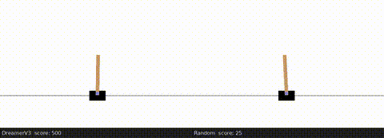
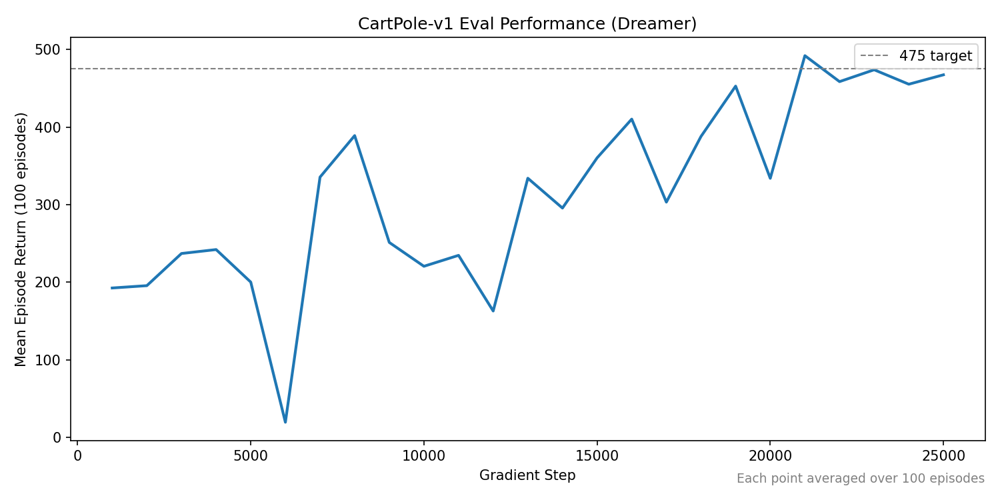

# DreamerV3 — Independent Implementation



A from-scratch PyTorch implementation of **DreamerV3** ([Hafner et al., 2023](https://arxiv.org/pdf/2301.04104)), built as a personal research project to deepen my understanding of model-based reinforcement learning approaches.

As always, I find that the best way to learn how something works is to build it yourself.

## Status

**CartPole-v1:** solved. Reached mean return of 491 over 100 greedy eval episodes, exceeding the standard solve threshold of 475.



**MiniGrid Memory:** in progress.

## Architecture

The implementation cleanly separates the **world model** from the **agent** that uses it for imagination-based training. This mirrors the conceptual split in the paper: a world model that *represents* the environment, and an agent that *plans* in it.

```text
src/
├── rl/
│   ├── world_model.py   # RSSM: posterior/prior nets, recurrent net, obs/reward decoders
│   ├── dreamer.py       # Agent: consumes the world model, runs imagined rollouts, trains actor
│   ├── critic.py        # Dual critic (with EMA target)
│   └── returns.py       # λ-returns for actor-critic targets
├── losses/              # World-model and actor-critic loss functions
├── nets/                # MLP, CNN, RNN building blocks
├── transforms/          # Twohot encoding, EMA
├── data/buffer.py       # Replay buffer
├── env/                 # Env wrappers (vector, pixel, MiniGrid, cue-delay-choice)
├── training/            # Trainer, collector, evaluator, checkpointing, metrics
└── config/              # Configs (typed dataclasses)
```

The world model is a self-contained dynamics module; imagination and policy logic live in the `Dreamer` class.

## Setup

This project uses [`uv`](https://github.com/astral-sh/uv) for dependency management.

```zsh
uv sync
```

Tested on macOS (M3 Max) and Linux (RTX 5090). Atari environments may have additional platform-specific requirements not yet validated here.

## Usage

```zsh
uv run main.py --config-name=config
```

To view MLflow dashboard:

```zsh
mlflow ui
```

## Implementation notes

These are notes from the build process — subtle issues I ran into, design decisions, and observations that may be useful to others reproducing the algorithm.

### Posterior/prior KL loss in stochastic start states

In environments with stochastic start states (e.g., the MiniGrid Memory task, where the object cue is randomly selected), the prior has no way to correctly predict the latent state from an initial zero recurrent tensor — unlike the posterior, which has access to the observation. This is problematic: the prior gets no clear learning signal, and the posterior is pulled toward the prior via the KL term, so both are negatively affected.

**Fix:** mask the KL loss whenever the recurrent state for that timestep is the initial zero tensor. This removes the noise from loss calculation. I haven't seen this addressed explicitly in other public implementations, so flagging it here.

### `sample()` vs. `rsample()` for stochastic latents

When sampling from logits to produce stochastic latent states, using `sample()` instead of `rsample()` silently breaks gradient flow through the sampling step. Training appears to proceed normally — losses go down, no errors — but the gradients through the stochastic latent path aren't propagating, and the model fails to learn the dynamics it needs. This took some time to track down.

Use `rsample()` (reparameterized sampling) for any latent variable that needs gradients flowing through it.

### Twohot reward/value encoding

DreamerV3 represents scalar rewards and values as twohot-encoded distributions over a fixed support, regressed with cross-entropy. Implemented as a small transform module in [src/transforms/twohot.py](src/transforms/twohot.py) with `encode` / `decode` paired so the rest of the codebase treats reward and value heads as standard classification problems.

### Dual critic with EMA target

The critic is a `DualCritic` ([src/rl/critic.py](src/rl/critic.py)) wrapping an online network and an exponential-moving-average target network ([src/transforms/ema.py](src/transforms/ema.py)). Wrapping it as a single `nn.Module` keeps target-network bookkeeping out of the training loop.

### `cue_delay_choice`: a minimal memory benchmark

[src/env/cue_delay_choice.py](src/env/cue_delay_choice.py) is a small custom environment for sanity-checking long-horizon memory in the world model with no confounds from exploration or observation noise. At `t=0` the agent receives a one-hot cue, observations go blank for `N` delay steps, then a go-signal appears and the agent must emit the action matching the original cue to receive reward. Useful as a controlled stress test for the recurrent state before tackling MiniGrid Memory.

## Personal commands

To get total lines of code (out of personal curiosity):

```zsh
find . -name "*.py" -not -path "./.venv/*" | xargs wc -l | sort -rn
```

## References

- Hafner et al., *Mastering Diverse Domains through World Models* — [arXiv:2301.04104](https://arxiv.org/pdf/2301.04104)
